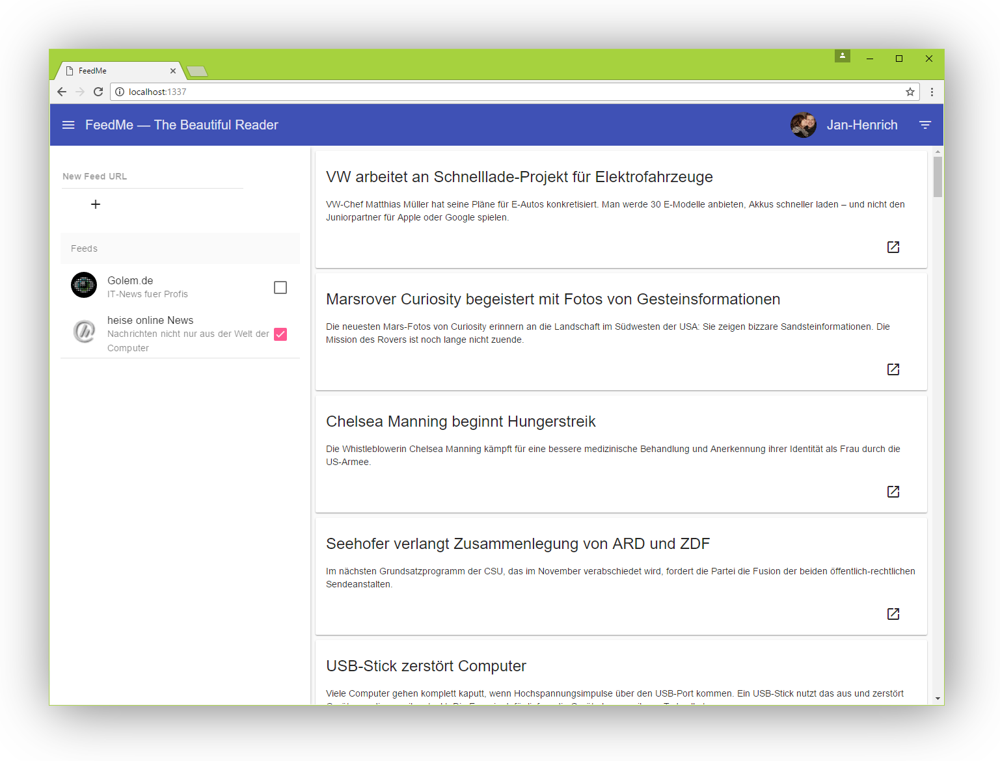

# Feed.me

> Feed.me is a responsive newsfeed reader based on node.js, express and Angular.

## Author

- Jan-Henrich Mattfeld

## Prerequisites

Download and install the most recent Node.js LTS release from [https://nodejs.org](https://nodejs.org/).

Make sure `node` and `npm` are in your path and you have installed Bower globally via `npm install -g bower`.

## Installation

1. `npm install` (This loads all third party modules)
2. `bower install` (This loads all third party frontend libraries)

## Folder Overview

* server: contains the server-side code
* client: contains all client-side files that will be served by the web server
* node_modules: contains all third party dependencies

## Start Up

* `node .` starts the application
* `npm start` starts the application with nodemon (automatic restart when files are changing)
* `http://localhost:1337` shows the app

## Routes

* `/` serves client/index.html
* `/feeds/get?url=example.com/feed.rss` retrieves a feed

## Troubleshooting

After a pull re-run `npm install` and `bower install` to get new dependencies.
